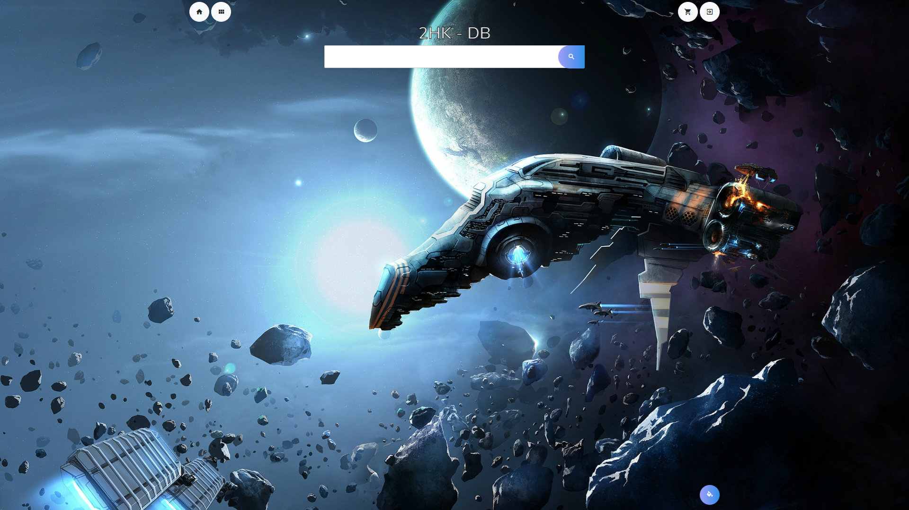
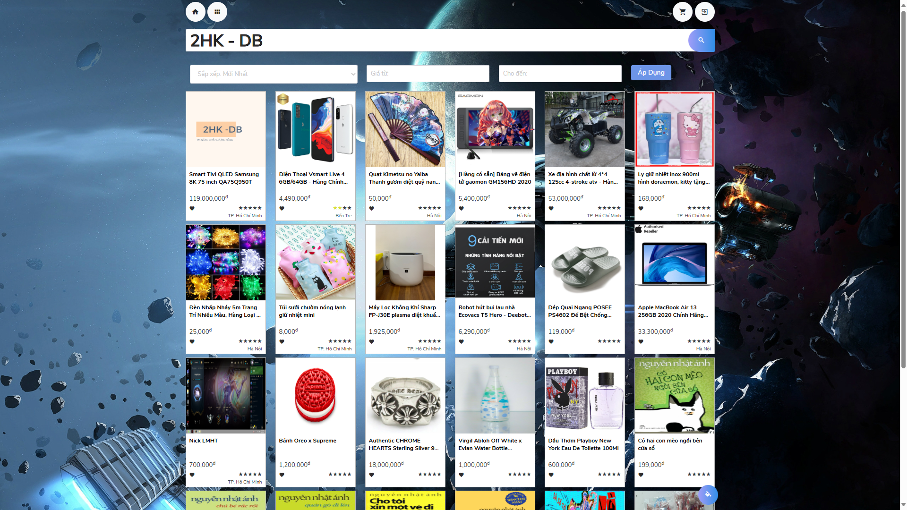
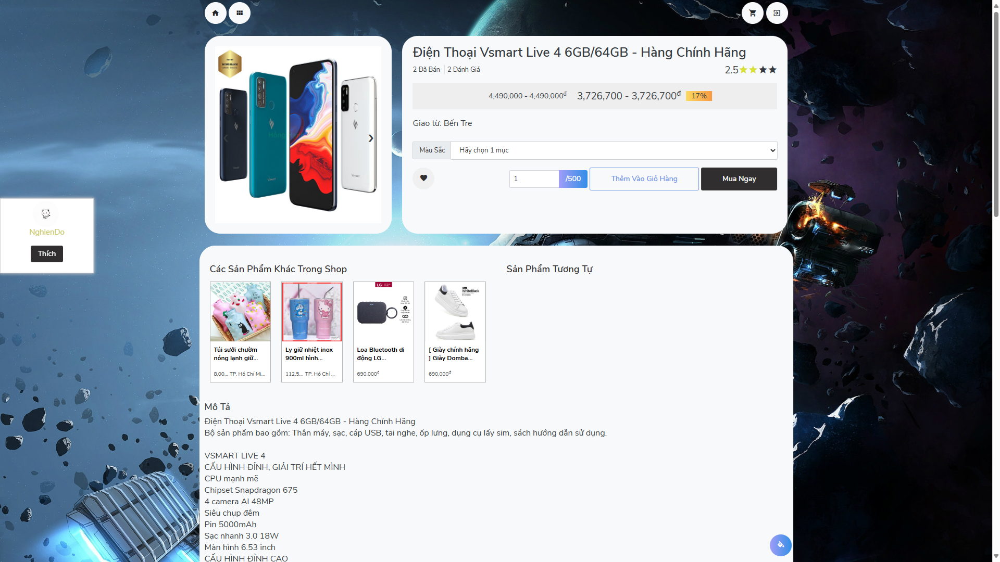

# 2hkinformatics - Fullstack E-commerce
My first project was built during my 12th grade computer science class. I worked on it alone for 5 months, using only pure PHP without any frameworks or OOP. It was simple, but it marked a significant milestone in my journey.
# Features
- User
    - Signin/ Signup
    - Filter product list
    - Shopping cart
    - Address management
    - Favorite product management
    - Order status
- Admin
    - Products management
    - Sales management
    - Categories management
    - Users management
    - Images management
    - Orders management
    - User shops management
# Tech stack
- PHP
- CSS
- Javascript
- jQuery
- Boostrap
- MySQL
# Images

